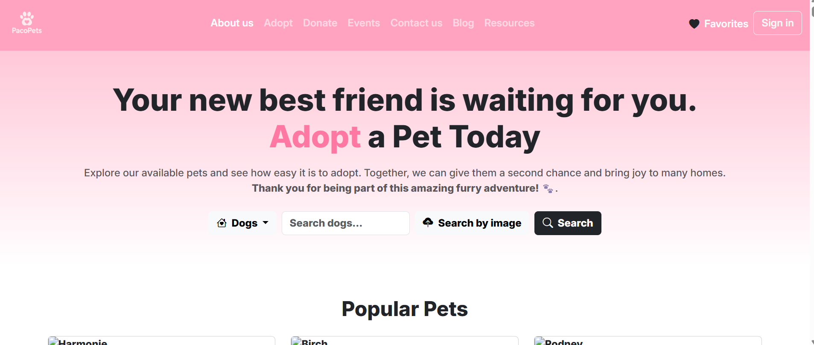

# 🐾 Paco Pets
---

**Paco Pets** is a friendly and minimalistic web application designed to help users easily adopt pets in need of a loving home. With a soft pastel color palette and an intuitive UI, this project provides a seamless and heartwarming experience for prospective pet parents.

 
---

## 💖 Características
---
- 🐶 Pet adoption listings with filters by type (dogs, cats, rabbits)
- 🔍 Text and image-based search functionality
- 💾 Favorites section to save potential matches
- 📱 Responsive design for all devices
- 🎨 Aesthetic UI with pastel tones (#FFA3C0)

## 📁 Folder Structure
---
PacoPets/
│
├── font/                 
├── img/                  
├── scripts/
│   └── pet.js            
├── style/
│   └── styles.css        
├── index.html            
└── README.md 

## 🌐 Technologies Used
---

- HTML5
- CSS3 + Bootstrap 5.3
- JavaScript
- Bootstrap Icons


## 🚀 Getting Started
---

1. Clone this repository:

```bash
git clone https://github.com/yourusername/paco-pets.git
cd paco-pets
```

Abres el archivo index.html junto al .js


### Como funciona 🛠️

---
Para la ejecución de cada uno de los programas solamente tiene que usar Visual Studio
Abre el archivo HTML en cualquier navegador moderno (como Google Chrome, Firefox, etc.).
Click derecho a: 

```sh
Open with Live Server
```
Si es necesario, asegúrate de que los archivos de js, estén correctamente vinculados para que la página se vea y funcione correctamente.

### Explicación del contenido 💡
---
En este repositorio encontrarás diferentes proyectos y prácticas realizadas durante el desarrollo del curso. Cada día de trabajo está organizado en carpetas separadas, donde se detallan los ejercicios y aprendizajes adquiridos.

Si tienes alguna pregunta o sugerencia, no dudes en contactarme. 🚀

---

Desarrollado por [SayaraAparicio](https://github.com/SayaraAparicio/)

